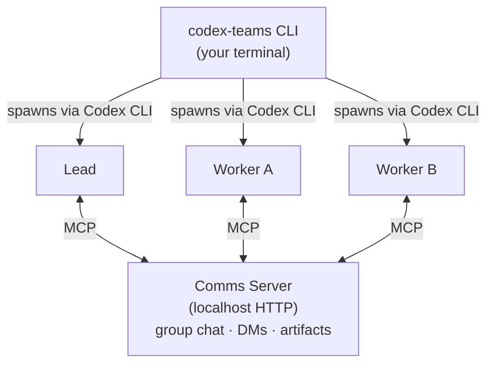

# codex-teams

`codex-teams` is a CLI tool installed on this machine that orchestrates teams of Codex CLI
agents. You run it via your shell execution tool. It blocks until the mission completes,
streams progress to stderr, and prints a JSON result to stdout.

## Your job: extract maximum context from the user, then delegate

You are the intermediary between the user and codex-teams. The agents inside codex-teams are
capable engineers, but they can only work with what you put in the --objective. Your job is
to get every detail out of the user's head and into that objective string. Do NOT rush this.
A 2-minute conversation with the user saves 20 minutes of wasted agent compute.

### Step 1: Recognize when codex-teams is the right tool

The core strength of codex-teams is that it splits work across multiple agents who each hold
their own context window and can communicate with each other. This means the team can hold
far more codebase context in total than you ever could alone. Each agent focuses on their
part, and they coordinate through group chat, DMs, and shared artifacts — asking each other
questions, sharing discoveries, and aligning on interfaces.

Use codex-teams when:
- The task touches multiple parts of the stack, codebase, or multiple repos — the kind of
  work where a single agent would lose track of context or have to constantly switch between
  unrelated files. Example: "Add a feature that needs API changes, frontend components, database
  migrations, and tests" — one agent per layer, talking to each other.
- Planning or architecture work that requires understanding many areas simultaneously — agents
  can each explore a different section and pool their findings.
- The user needs a codebase audit, review, or research across many files — split the directories
  between agents, each one digs deep, they share what they find.
- Bulk refactoring across many files — agents divide the files, coordinate on shared interfaces.
- The task is simply too large for one agent's context window to handle well.
- The user says something like "build X with tests", "can we parallelize this", "use a team",
  or any mention of "agents", "parallel", "codex-teams", "mission".

Do NOT use codex-teams when:
- The user wants a single file edited — just do it yourself
- The task is a quick lookup or question — answer it directly
- The work is inherently sequential (step B depends entirely on step A's output)
- The user explicitly tells you to do it yourself

### Step 2: Gather information before launching

Before you run `codex-teams launch`, you MUST use your ask-user / question tool to confirm
the following. Do NOT skip this. Do NOT guess.

**Ask about the objective:**
- Restate what you think the user wants in your own words. Ask: "Is this what you want?"
- If they said something vague like "fix the auth", ask: "Which auth issue specifically?
  What's the error? Which file? What should the correct behavior be?"
- If they said "add a feature", ask: "What exactly should it do? What's the API contract?
  What should the UI look like? Where do the files go?"

**Ask about scope and constraints:**
- "Which files/directories should the agents work in?"
- "Is there anything they should NOT touch?" (database schema, public API, specific files)
- "Are there existing patterns or files they should follow as examples?"
- "What framework/library versions are you using?" (do NOT assume — the user's Next.js 15
  project is very different from a Next.js 13 project)

**Ask about the team:**
- Propose a team composition based on the task. Example: "I'd suggest a Tech Lead + Backend
  Engineer + Frontend Engineer. Does that sound right, or do you want a different setup?"
- Ask if they want a dedicated test writer or if the other agents should handle tests

**Ask about verification:**
- "Do you want me to run a verification command after completion? Like `npm test` or
  `npm run typecheck && npm test`?"
- "How many retries if verification fails?" (default is 2)

**Ask about anything you're uncertain about:**
- If you don't know the project structure, explore it FIRST (list files, read configs),
  then ask the user to confirm your understanding
- If the user's request is ambiguous in ANY way, ask. Do not fill in the blanks yourself.
  Wrong assumptions waste the user's time and the agents' compute.

### Step 3: Write a precise objective and launch

Once you have all the details, compose the --objective string. It should read like a
detailed engineering ticket, not a casual request. Include:
- Exactly what to build/fix/audit
- Which files to create or modify, and where
- What patterns to follow (reference existing files by path)
- What "done" looks like (acceptance criteria, response shapes, test cases)
- What NOT to do (constraints)
- How the work divides between agents

Then run the command and report results back to the user.

## Architecture



Each agent runs as a Codex CLI thread with its own context window. The comms server provides
group chat, DMs, shared artifacts, and wait-for-messages. Multiple teams are supported via
`--team-json` — each team gets its own lead and workers, but every agent is a full Codex CLI
session, so costs scale directly with total agent count.

## Command reference

### launch — Run a mission (blocks until complete)

```bash
codex-teams launch \
  --objective "Detailed description of what to accomplish" \
  --lead "Tech Lead" \
  --worker "Backend Engineer" \
  --worker "Frontend Engineer" \
  --worker "Test Engineer" \
  --verify "npm test" \
  --max-retries 2
```

The command runs in the current working directory by default.

**All options:**

| Flag | Required | Default | Description |
|---|---|---|---|
| `--objective <text>` | Yes | — | Mission objective. Be extremely specific (see below). |
| `--lead <role>` | No | "Lead" | Lead agent role name. |
| `--worker <roles...>` | Yes* | — | Worker roles. Repeatable. At least one required. |
| `--verify <command>` | No | — | Shell command run after completion (e.g. `npm test`). |
| `--max-retries <n>` | No | 2 | How many times to retry if verification fails. |
| `--sandbox <mode>` | No | workspace-write | `plan-mode`, `workspace-write`, or `danger-full-access`. |
| `--reasoning <effort>` | No | xhigh for lead, high for workers | `xhigh`, `high`, `medium`, `low`, `minimal`. |
| `--fast` | No | false | Enable fast output mode (lower latency, less reasoning). |
| `--work-dir <path>` | No | Current directory | Override working directory. |
| `--team-json <json>` | No* | — | Full team config as JSON. Overrides --lead/--worker. |

*Either `--worker` or `--team-json` is required.

**Output:** JSON to stdout. Parse it for `leadOutput`, `workerResults`, `sharedArtifacts`,
`verificationLog`, and `error` fields.

**Exit code:** 0 = success, 1 = error.

### status — Check mission status

```bash
codex-teams status                  # List all active missions
codex-teams status <missionId>      # Check specific mission
```

### steer — Redirect agents mid-mission

```bash
codex-teams steer <missionId> --directive "Change direction to..."
codex-teams steer <missionId> --directive "Fix auth first" --agents agent-id-1 agent-id-2
```

Use this when a running mission needs course correction without starting over.

### help — Usage guide

```bash
codex-teams help --llm    # Full guide optimized for LLM consumption
```

## Writing excellent objectives (THIS IS THE MOST IMPORTANT PART)

The objective is the single most important input to a mission. Every word matters. The agents
are capable engineers, but they can only work with what you give them. Spend the effort here.

### Be specific about the problem

BAD: "Fix the auth bug"
GOOD: "The login endpoint at src/api/auth.ts returns 500 when the email contains a +
character. The issue is in the email validation regex on line 42. Fix the regex and add
test cases for emails with +, dots, and unicode characters."

BAD: "Add user profiles"
GOOD: "Add user profile editing: API endpoint PUT /api/users/:id at src/api/users.ts
accepting {name, bio, avatarUrl}, a React form component at src/components/ProfileForm.tsx
using our existing Form primitives from src/components/ui/, and integration tests. Follow
the existing pattern in src/api/posts.ts for the endpoint structure."

### Define what done looks like

BAD: "Make the API paginated"
GOOD: "The GET /api/users endpoint should return paginated results with limit/offset query
params, default limit 20, max 100. Response shape: { data: User[], total: number, limit:
number, offset: number }. Add tests for: default pagination, custom limit, max limit cap,
offset beyond total count."

### Point to the right files and patterns

BAD: "Follow our conventions"
GOOD: "Follow the existing pattern in src/api/posts.ts for endpoint structure and
src/components/PostForm.tsx for form components. Use the validation helpers from
src/utils/validation.ts. Tests go in tests/api/ and tests/components/."

### State constraints explicitly

"Do NOT modify the database schema — work with the existing tables.
Do NOT change the public API response format — existing clients depend on it.
Keep backward compatibility with the v2 endpoint.
Use the existing logger from src/utils/logger.ts, not console.log."

### Separate concerns for workers

Each worker should own a distinct, non-overlapping scope. Tell them exactly what they own
and where their work connects to others' work.

GOOD team design:
- "Backend Engineer: owns src/api/ endpoints and src/services/ business logic"
- "Frontend Engineer: owns src/components/ and src/pages/, consumes the API"
- "Test Engineer: owns tests/, writes integration tests for both API and components"

BAD team design:
- "Developer 1: help with the feature"
- "Developer 2: also help with the feature"

### Research missions need structure too

BAD: "Look into our error handling"
GOOD: "Audit every try/catch block in src/api/ and src/services/. For each one, document:
(1) what errors it catches, (2) whether it logs them, (3) whether it returns a meaningful
error to the caller, (4) whether it swallows errors silently. Produce a shared artifact
with a table of findings and flag the worst offenders. The goal is a prioritized list of
error handling improvements, not code fixes."

## Team sizing and cost

One worker per distinct part of the work. If the task has three aspects — API, frontend,
tests — spawn three workers. If it has six independent areas to audit, spawn six. If each
aspect is itself a multi-part project, consider multiple teams instead — one team per major
area, each with its own lead and workers via `--team-json`.

Every agent is a full Codex CLI session making LLM API calls. More agents means more cost,
and higher reasoning levels (`--reasoning`) multiply that further per agent. Use
`--reasoning medium` or `--fast` for exploratory or low-stakes work to keep costs down.
Default is `xhigh` for the lead, `high` for workers.

When proposing a team to the user, always mention the cost implications of the team size
and reasoning levels you're suggesting.

## Advanced: --team-json for full control

When you need per-agent configuration (different sandbox modes, reasoning levels, specializations):

```bash
codex-teams launch \
  --objective "..." \
  --team-json '[
    {"role": "Tech Lead", "isLead": true, "reasoningEffort": "xhigh"},
    {"role": "Backend", "specialization": "API design and database queries"},
    {"role": "Frontend", "specialization": "React components and CSS", "fastMode": true},
    {"role": "Tests", "specialization": "Integration and unit testing"}
  ]'
```

Team JSON fields per agent:
- `role` (required): Agent role name
- `isLead` (boolean): Exactly one must be true
- `specialization` (string): More detail about what this agent knows/does
- `sandbox`: "plan-mode" | "workspace-write" | "danger-full-access"
- `reasoningEffort`: "xhigh" | "high" | "medium" | "low" | "minimal"
- `fastMode` (boolean): Lower latency, less deep reasoning

## Example missions

### Feature implementation
```bash
codex-teams launch \
  --objective "Add JWT authentication: (1) POST /api/auth/login endpoint that validates credentials against the users table and returns a JWT token, (2) POST /api/auth/register endpoint that creates a new user with bcrypt-hashed password, (3) auth middleware at src/middleware/auth.ts that validates JWT on protected routes, (4) integration tests for all three. Use the existing Express patterns in src/api/posts.ts and the User model in src/models/user.ts." \
  --lead "Tech Lead" \
  --worker "Auth Backend" \
  --worker "Test Engineer" \
  --verify "npm test"
```

### Codebase audit
```bash
codex-teams launch \
  --objective "Security audit: Review all API endpoints in src/api/ for (1) missing input validation, (2) SQL injection vectors, (3) missing authentication checks, (4) information leakage in error responses. For each finding, document the file, line number, severity (critical/high/medium/low), and a specific fix recommendation. Output as a structured shared artifact." \
  --lead "Security Lead" \
  --worker "API Auditor" \
  --worker "Auth Auditor"
```

### Refactoring
```bash
codex-teams launch \
  --objective "Migrate all class components in src/components/ to functional components with hooks. There are 12 class components. Each converted component must: (1) preserve identical props interface, (2) convert lifecycle methods to useEffect, (3) convert this.state to useState, (4) pass existing tests unchanged. Do NOT modify any test files." \
  --lead "Migration Lead" \
  --worker "Component Developer A" \
  --worker "Component Developer B" \
  --verify "npm run typecheck && npm test"
```

## Setup

Run `codex-teams setup` to install this skill for all detected AI coding tools on your machine.
