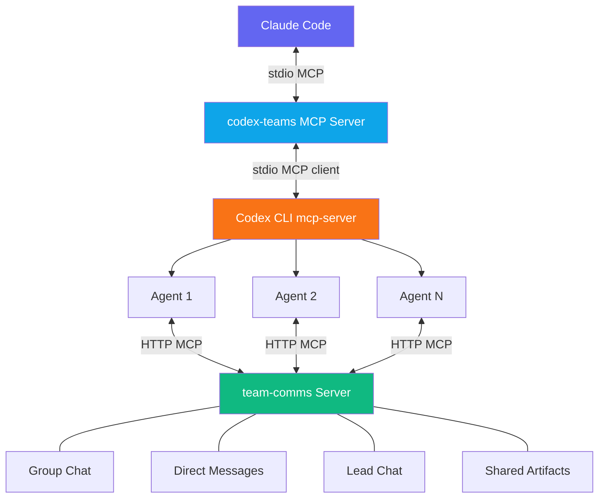
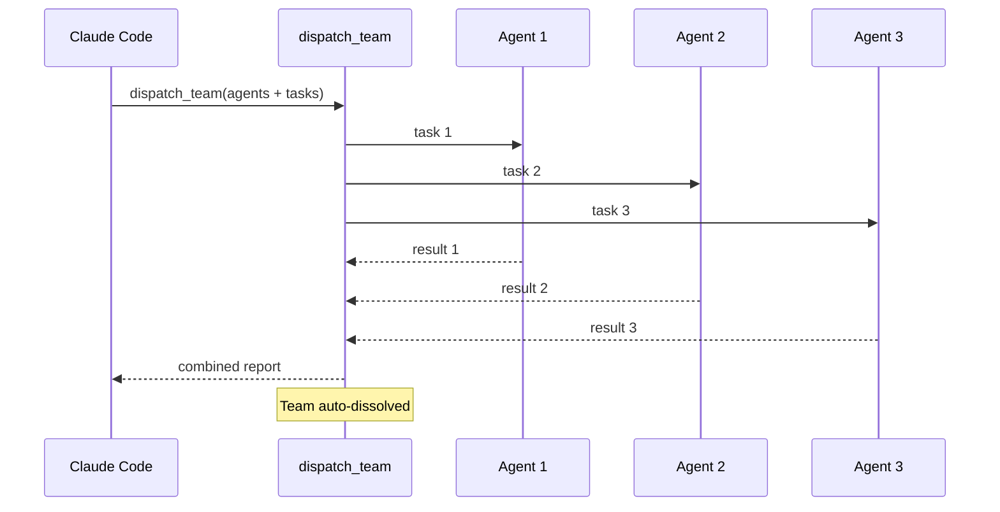
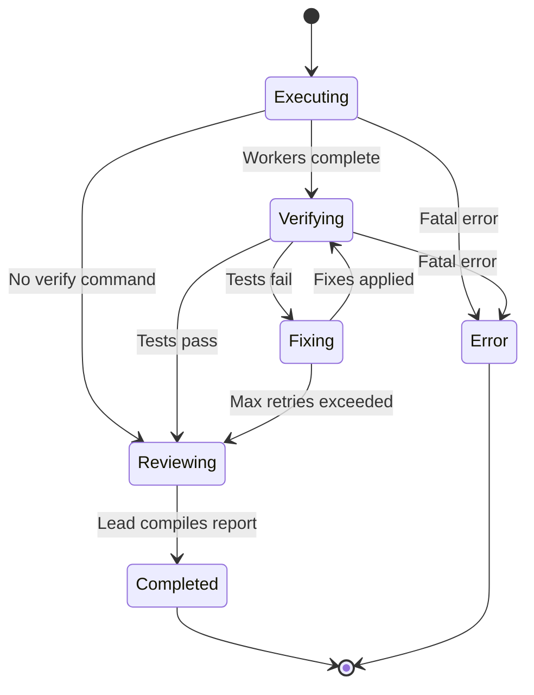
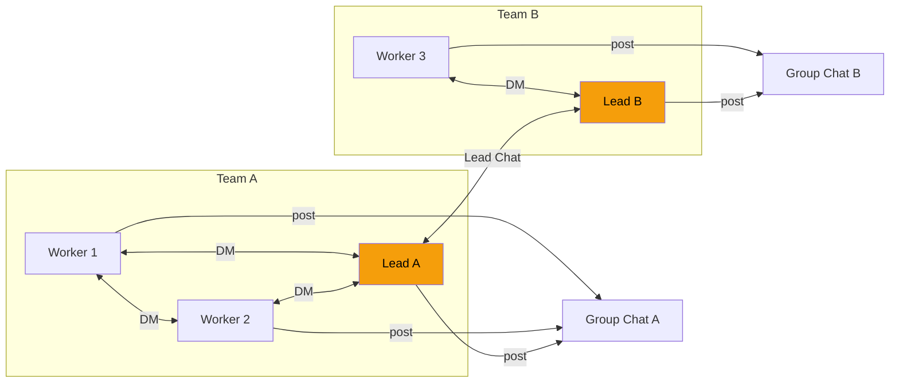

# codex-teams

MCP server for team-based agent orchestration. Creates teams of AI agents that work together autonomously — with structured communication, task dependencies, and verification loops — powered by [Claude Code](https://code.claude.com/docs) and the [Codex CLI](https://github.com/openai/codex).

## Architecture



**Three servers, one system:**

| Server | Transport | Purpose |
|--------|-----------|---------|
| codex-teams | stdio MCP | Exposes team/agent/task/mission tools to Claude Code |
| Codex CLI | stdio MCP client | Spawns agent threads, executes tasks |
| team-comms | HTTP MCP | Agent-to-agent communication (group chat, DMs, artifacts) |

## Features

- **Team management** — Create teams with specialized agents, each with their own model, sandbox, and instructions
- **Three execution modes** — Direct messaging, parallel dispatch, and full missions with lead coordination
- **Structured communication** — Group chat, direct messages, cross-team lead chat, shared artifacts
- **Task dependencies** — Assign tasks with prerequisites; completed tasks auto-trigger dependents
- **Verification loops** — Missions can run shell commands (e.g., `npm test`) after execution and auto-retry fixes
- **Agent identity enforcement** — Per-agent tokens prevent impersonation on the comms server
- **Localhost-only** — Comms server binds to `127.0.0.1`; no external exposure

## Prerequisites

- Node.js 18+
- [Claude Code](https://code.claude.com/docs)
- [Codex CLI](https://github.com/openai/codex) installed and on PATH (`codex mcp-server` must be available)

## Installation

### Plugin marketplace (recommended)

```bash
# Add the marketplace
/plugin marketplace add skrabe/codex-teams

# Install the plugin
/plugin install codex-teams@codex-teams
```

### From source

```bash
git clone https://github.com/skrabe/codex-teams.git
cd codex-teams
npm install && npm run build
claude mcp add --transport stdio codex-teams -- node $(pwd)/build/index.js
```

### Verify

```bash
claude mcp list   # Check it's registered
/mcp              # Check status inside Claude Code
```

### Uninstall

```bash
# Plugin
/plugin uninstall codex-teams@codex-teams

# Or if installed via CLI
claude mcp remove codex-teams
```

## Usage Modes

### 1. Direct — `send_message`

Send a message to a single agent and get their response. Good for targeted questions or sequential workflows.

```
create_team → send_message → get_output
```

### 2. Dispatch — `dispatch_team`

Fire-and-forget parallel execution. Creates a team, sends each agent their task simultaneously, collects results, dissolves the team.



### 3. Mission — `launch_mission`

Full async orchestration with a lead agent coordinating workers through group chat and DMs, optional verification, and fix-retry loops.



**Mission flow:**
1. Lead and workers start simultaneously
2. Lead posts task assignments to group chat in a single message
3. Workers read assignments, execute autonomously, post progress
4. Workers share deliverables via `share()`
5. If `verifyCommand` set: run it, lead assigns fixes on failure, workers retry
6. Lead compiles final report from worker results + comms history
7. Team auto-dissolved on completion

## Tools Reference

### Team Management

| Tool | Description |
|------|-------------|
| `create_team` | Create a team with multiple agents (roles, specializations, models, sandbox modes) |
| `dissolve_team` | Dissolve a team and clean up all communication channels |

### Agent Management

| Tool | Description |
|------|-------------|
| `add_agent` | Add an agent to an existing team |
| `remove_agent` | Remove an agent (blocked if working or has tasks) |
| `list_agents` | List all agents with status, model, and task count |

### Communication (User → Agent)

| Tool | Description |
|------|-------------|
| `send_message` | Send a message to an agent, get their response |
| `broadcast` | Message all (or subset of) agents in parallel |
| `relay` | Forward one agent's output to another agent (or all) |

### Task Management

| Tool | Description |
|------|-------------|
| `assign_task` | Assign a task with optional dependencies; auto-starts if unblocked |
| `task_status` | Get status of all tasks in a team |
| `complete_task` | Mark complete; auto-triggers unblocked dependents |

### Dispatch

| Tool | Description |
|------|-------------|
| `dispatch_team` | Create team, run all tasks in parallel, collect results, dissolve |

### Missions

| Tool | Description |
|------|-------------|
| `launch_mission` | Launch async mission with lead + workers, optional verification |
| `mission_status` | Check current phase of a mission |
| `await_mission` | Block until mission completes, return full results + comms log |
| `get_team_comms` | View all communication for a team |

### Results

| Tool | Description |
|------|-------------|
| `get_output` | Get an agent's last output and status |
| `get_team_report` | Full team report with all agents and task summary |

### Agent Communication (via team-comms HTTP server)

These tools are available to agents themselves during execution:

| Tool | Description |
|------|-------------|
| `group_chat_post` | Post to your team's group chat |
| `group_chat_read` | Read unread group chat messages |
| `group_chat_peek` | Check unread count |
| `dm_send` | Send a direct message (same team, or cross-team between leads) |
| `dm_read` | Read unread DMs |
| `dm_peek` | Check unread DM count |
| `lead_chat_post` | Post to cross-team lead channel (leads only) |
| `lead_chat_read` | Read cross-team messages (leads only) |
| `lead_chat_peek` | Check cross-team unread count (leads only) |
| `share` | Share data/file paths with your team |
| `get_shared` | See everything the team has shared |
| `get_team_context` | See all teams, agents, roles, specializations, status, and tasks |

## Communication System



**Routing rules:**
- **Same team** — DM directly with `dm_send`
- **Cross-team** — Only leads can DM each other via `lead_chat`. Workers must ask their lead to relay messages.

Agents can call `get_team_context` to discover all teams, agents, and their specializations on demand — then decide whether to DM a teammate or ask their lead to coordinate cross-team.

## Configuration

### Agent Defaults

| Setting | Default |
|---------|---------|
| Model | `gpt-5.3-codex` |
| Sandbox | `workspace-write` |
| Approval Policy | `never` |
| Reasoning Effort | `xhigh` (leads), `high` (workers) |
| Working Directory | `process.cwd()` |

### Agent Config Options

```typescript
{
  role: string;              // Agent role name
  specialization?: string;   // Area of expertise
  model?: string;            // LLM model to use
  sandbox?: "read-only" | "workspace-write" | "danger-full-access";
  baseInstructions?: string; // Custom instructions appended to generated ones
  cwd?: string;              // Working directory
  approvalPolicy?: "untrusted" | "on-request" | "on-failure" | "never";
  isLead?: boolean;          // Team lead (one per team for missions)
}
```

## Testing

```bash
node --import tsx --test tests/*.test.ts
```

170 tests across 7 test files covering state management, communication, tool handlers, dispatching, missions, instruction generation, and access control.

## Development

```bash
npm run dev   # Watch mode — recompiles on changes
```

## License

[MIT](LICENSE)
