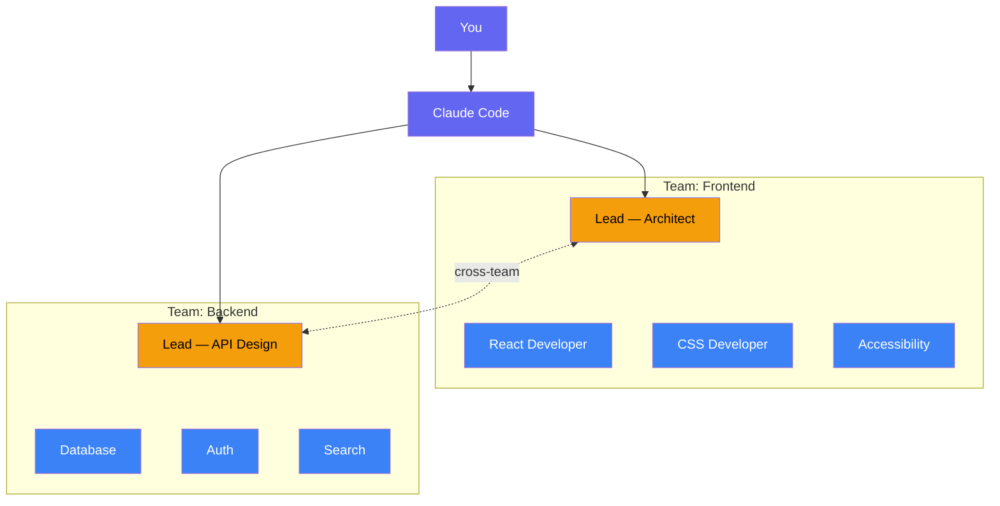
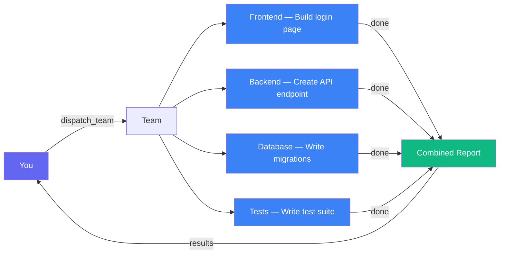
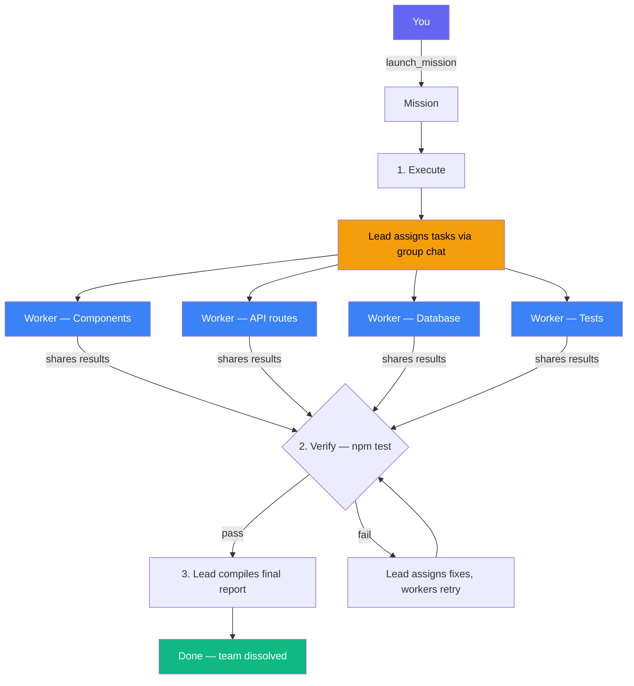
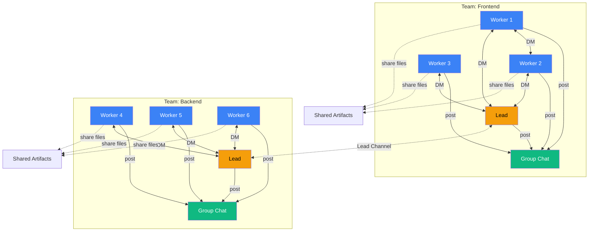

# codex-teams

Spawn teams of AI agents from Claude Code. Each team has a lead and workers that collaborate autonomously — chatting, sharing files, and coordinating through structured channels — while you watch or go grab coffee.

Powered by [Claude Code](https://code.claude.com/docs) and the [Codex CLI](https://github.com/openai/codex).



## Features

- **Teams with leads and workers** — Each agent has a role, specialization, and their own sandbox
- **Three ways to run** — Quick message, parallel dispatch, or full missions with lead coordination
- **Agents talk to each other** — Group chat, DMs, cross-team lead channel, shared artifacts
- **Task dependencies** — Tasks auto-start when their prerequisites complete
- **Verification loops** — Run `npm test` (or any command) after a mission, auto-retry fixes if it fails
- **Secure** — Per-agent identity tokens, localhost-only comms

## Prerequisites

- Node.js 18+
- [Claude Code](https://code.claude.com/docs)
- [Codex CLI](https://github.com/openai/codex) installed and on PATH (`codex mcp-server` must be available)

## Installation

### Plugin marketplace (recommended)

```bash
# Add the marketplace
/plugin marketplace add skrabe/codex-teams

# Install the plugin
/plugin install codex-teams@codex-teams
```

### From source

```bash
git clone https://github.com/skrabe/codex-teams.git
cd codex-teams
npm install && npm run build
claude mcp add --transport stdio codex-teams -- node $(pwd)/build/index.js
```

### Verify

```bash
claude mcp list   # Check it's registered
/mcp              # Check status inside Claude Code
```

### Uninstall

```bash
# Plugin
/plugin uninstall codex-teams@codex-teams

# Or if installed via CLI
claude mcp remove codex-teams
```

## How It Works

### Dispatch — parallel fire-and-forget

Give each agent a task. They all run at once, results come back, team dissolves.



### Mission — lead coordinates workers

A lead agent plans the work, assigns tasks via group chat, workers execute autonomously, then optional verification runs tests and retries fixes.



### Direct messaging — manual control

Create a team, send messages to individual agents, relay outputs between them. Full control over the conversation.

```
create_team → send_message → relay → get_output
```

## Tools Reference

### Team Management

| Tool | Description |
|------|-------------|
| `create_team` | Create a team with multiple agents (roles, specializations, models, sandbox modes) |
| `dissolve_team` | Dissolve a team and clean up all communication channels |

### Agent Management

| Tool | Description |
|------|-------------|
| `add_agent` | Add an agent to an existing team |
| `remove_agent` | Remove an agent (blocked if working or has tasks) |
| `list_agents` | List all agents with status, model, and task count |

### Communication (User → Agent)

| Tool | Description |
|------|-------------|
| `send_message` | Send a message to an agent, get their response |
| `broadcast` | Message all (or subset of) agents in parallel |
| `relay` | Forward one agent's output to another agent (or all) |

### Task Management

| Tool | Description |
|------|-------------|
| `assign_task` | Assign a task with optional dependencies; auto-starts if unblocked |
| `task_status` | Get status of all tasks in a team |
| `complete_task` | Mark complete; auto-triggers unblocked dependents |

### Dispatch

| Tool | Description |
|------|-------------|
| `dispatch_team` | Create team, run all tasks in parallel, collect results, dissolve |

### Missions

| Tool | Description |
|------|-------------|
| `launch_mission` | Launch async mission with lead + workers, optional verification |
| `mission_status` | Check current phase of a mission |
| `await_mission` | Block until mission completes, return full results + comms log |
| `get_team_comms` | View all communication for a team |

### Results

| Tool | Description |
|------|-------------|
| `get_output` | Get an agent's last output and status |
| `get_team_report` | Full team report with all agents and task summary |

### Agent-to-Agent Communication

These tools are used by agents themselves during execution — you don't call these directly:

| Tool | Description |
|------|-------------|
| `group_chat_post` | Post to your team's group chat |
| `group_chat_read` | Read unread group chat messages |
| `group_chat_peek` | Check unread count |
| `dm_send` | Send a direct message (same team, or cross-team between leads) |
| `dm_read` | Read unread DMs |
| `dm_peek` | Check unread DM count |
| `lead_chat_post` | Post to cross-team lead channel (leads only) |
| `lead_chat_read` | Read cross-team messages (leads only) |
| `lead_chat_peek` | Check cross-team unread count (leads only) |
| `share` | Share data/file paths with your team |
| `get_shared` | See everything the team has shared |
| `get_team_context` | See all teams, agents, roles, specializations, status, and tasks |

## How Agents Communicate

Agents talk to each other autonomously — you don't route messages. Each team gets its own channels:



| Channel | Who can use it | Purpose |
|---------|---------------|---------|
| **Group Chat** | Everyone on the team | Task updates, progress, questions |
| **Direct Messages** | Teammates (same team) | 1-on-1 coordination, asking for help |
| **Lead Channel** | Leads only (cross-team) | Cross-team coordination between leads |
| **Shared Artifacts** | Everyone on the team | Share file paths, outputs, deliverables |

Workers can't message outside their team. If they need something from another team, they ask their lead — who coordinates via the lead channel.

## Configuration

### Agent Defaults

| Setting | Default |
|---------|---------|
| Model | `gpt-5.3-codex` |
| Sandbox | `workspace-write` |
| Approval Policy | `never` |
| Reasoning Effort | `xhigh` (leads), `high` (workers) |
| Working Directory | `process.cwd()` |

### Agent Config Options

```typescript
{
  role: string;              // Agent role name
  specialization?: string;   // Area of expertise
  model?: string;            // LLM model to use
  sandbox?: "read-only" | "workspace-write" | "danger-full-access";
  baseInstructions?: string; // Custom instructions appended to generated ones
  cwd?: string;              // Working directory
  approvalPolicy?: "untrusted" | "on-request" | "on-failure" | "never";
  isLead?: boolean;          // Team lead (one per team for missions)
}
```

## Testing

```bash
node --import tsx --test tests/*.test.ts
```

170 tests across 7 test files covering state management, communication, tool handlers, dispatching, missions, instruction generation, and access control.

## Development

```bash
npm run dev   # Watch mode — recompiles on changes
```

## License

[MIT](LICENSE)
