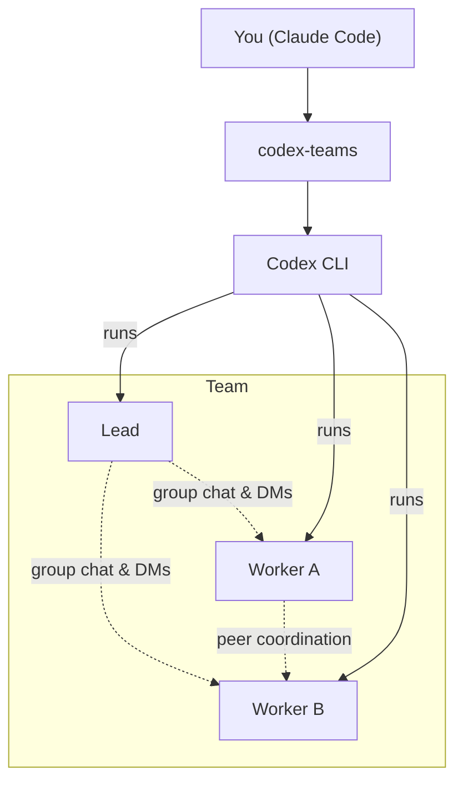

# codex-teams

Create AI agent teams inside Claude Code, powered by the Codex CLI.

Describe what you want built or researched — codex-teams spins up a team that plans together, divides the work, and delivers results.

## How It Works

You give a goal. codex-teams creates a team with a lead and workers. The lead breaks down the work, the workers execute in parallel, and they coordinate through group chat and DMs — like a real engineering team.

```
You: "Ship user profile editing with validation and tests"

codex-teams:
  → Lead plans the approach, assigns work
  → Frontend dev builds the form
  → Backend dev adds the API endpoint
  → Test dev writes integration tests
  → Lead compiles the final report
```

Teams auto-dissolve when done. Code never leaves your machine without your approval — agents can't run git or GitHub commands.

## Quick Start

### Prerequisites

- Node.js 18+
- [Claude Code](https://code.claude.com/docs)
- [Codex CLI](https://github.com/openai/codex) installed and on `PATH`

### Install

**Plugin marketplace (recommended):**

```bash
/plugin marketplace add skrabe/codex-teams
/plugin install codex-teams@codex-teams
```

**From source:**

```bash
git clone https://github.com/skrabe/codex-teams.git
cd codex-teams
npm install && npm run build
claude mcp add --transport stdio codex-teams -- node $(pwd)/build/index.js
```

### Verify

```bash
claude mcp list
```

You should see `codex-teams` listed.

## Examples

### Ship a feature

> "Launch a mission to add a settings page with API endpoints and tests. Use npm test to verify."

The team plans together, builds in parallel, runs your test command, and fixes failures automatically.

### Research a problem

> "Dispatch a team to research auth options for our app — one agent on requirements, one on technical approaches, one on security risks."

Each agent researches independently, and you get a combined report.

### Quick parallel tasks

> "Dispatch three agents: one to refactor the utils, one to update the API docs, one to add error handling to the auth flow."

All three work simultaneously. Results come back together.

## Two Main Modes

**Mission** — for coordinated work. A lead plans and manages workers. Workers communicate, help each other, and iterate. Supports a verify command (like `npm test`) with automatic retries.

**Dispatch** — for parallel fire-and-forget. Each agent gets a task, works independently, results are merged. Fast and simple.

## Architecture



Each agent runs as a Codex thread. Agents communicate through a localhost-only MCP server with per-agent auth tokens.

## Configuration

Agents use sensible defaults. Override per-agent when needed:

| Setting | Default | Options |
|---|---|---|
| Model | `gpt-5.3-codex` | Any supported model |
| Sandbox | `workspace-write` | `read-only`, `workspace-write`, `danger-full-access` |
| Reasoning | `xhigh` (lead) / `high` (workers) | `xhigh`, `high`, `medium`, `low` |

## Development

```bash
npm install && npm run build
node --import tsx --test tests/*.test.ts
```

## Uninstall

```bash
/plugin uninstall codex-teams@codex-teams
# or: claude mcp remove codex-teams
```

## License

[MIT](LICENSE)
