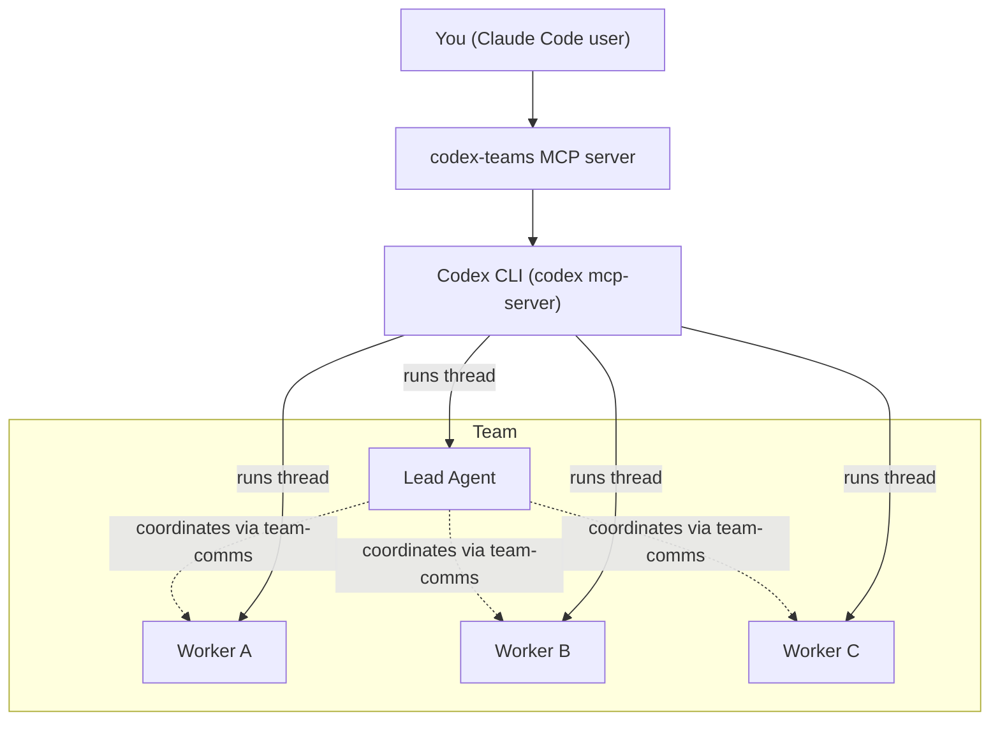

# codex-teams

Create AI agent teams inside Claude Code, powered by the Codex CLI.

If you can describe a feature or a research question, `codex-teams` can spin up a lead + workers to execute it in parallel.

## What This Is

`codex-teams` is an MCP server that lets Claude Code run multi-agent workflows:

- One-off parallel execution (`dispatch_team`)
- Fully autonomous missions with a lead coordinating workers (`launch_mission`)
- Manual team control (create team, message agents, assign tasks, relay outputs)
- Research sprints (compare options, gather evidence, synthesize findings)

Agents can communicate through:

- Team group chat
- Direct messages
- Cross-team lead channel
- Shared artifacts

## Why People Use It

- You want speed: parallelize frontend/backend/test work.
- You want faster research: split discovery, comparison, and synthesis across agents.
- You want coordination: a lead agent can assign and unblock workers.
- You want less micromanagement: workers self-coordinate through structured channels.
- You still want control: every workflow can be inspected with status/report tools.

## Quick Start (2-5 Minutes)

### 1) Prerequisites

- Node.js 18+
- [Claude Code](https://code.claude.com/docs)
- [Codex CLI](https://github.com/openai/codex) installed and on `PATH` (`codex mcp-server` must work)

### 2) Install

#### Option A: Claude plugin marketplace (recommended)

```bash
/plugin marketplace add skrabe/codex-teams
/plugin install codex-teams@codex-teams
```

#### Option B: From source

```bash
git clone https://github.com/skrabe/codex-teams.git
cd codex-teams
npm install
npm run build
claude mcp add --transport stdio codex-teams -- node $(pwd)/build/index.js
```

### 3) Verify

```bash
claude mcp list
/mcp
```

You should see `codex-teams` available.

## Pick a Workflow

| Mode | Best for | Core tool |
|---|---|---|
| Manual | You want tight control and step-by-step steering | `create_team` |
| Dispatch | You want fast parallel fire-and-forget coding or research probes | `dispatch_team` |
| Mission | You want autonomous lead+worker coordination for implementation or research synthesis | `launch_mission` |

## Copy-Paste Starter Recipes

These are MCP tool argument examples you can adapt.

### Recipe 1: Fast parallel burst (`dispatch_team`)

```json
{
  "name": "feature-burst",
  "workDir": "/absolute/path/to/your/repo",
  "agents": [
    {
      "role": "frontend",
      "specialization": "React UI",
      "task": "Implement a responsive settings page with loading and error states."
    },
    {
      "role": "backend",
      "specialization": "API",
      "task": "Add the settings update endpoint and validation."
    },
    {
      "role": "tests",
      "specialization": "QA",
      "task": "Write tests for settings read/update flow."
    }
  ]
}
```

What happens:

- Team is created
- All tasks run in parallel
- Combined report is returned
- Team is auto-dissolved

### Recipe 2: Autonomous mission (`launch_mission`)

```json
{
  "objective": "Ship user profile editing with validation, persistence, and tests.",
  "workDir": "/absolute/path/to/your/repo",
  "team": [
    { "role": "tech-lead", "isLead": true },
    { "role": "frontend-dev", "specialization": "forms and UX" },
    { "role": "backend-dev", "specialization": "API and data model" },
    { "role": "test-dev", "specialization": "integration and regression tests" }
  ],
  "verifyCommand": "npm test",
  "maxVerifyRetries": 2
}
```

Then:

1. Call `mission_status` with the returned `missionId` to check progress.
2. Call `await_mission` when you want a blocking final result.

### Recipe 3: Parallel research sprint (`dispatch_team`)

```json
{
  "name": "research-sprint",
  "workDir": "/absolute/path/to/your/repo",
  "agents": [
    {
      "role": "requirements-researcher",
      "specialization": "product and user requirements",
      "task": "Analyze requirements from docs/issues and produce a structured requirements summary with assumptions."
    },
    {
      "role": "technical-researcher",
      "specialization": "framework docs and implementation options",
      "task": "Research 2-3 technical approaches, list tradeoffs, and recommend one with rationale."
    },
    {
      "role": "risk-analyst",
      "specialization": "edge cases and failure modes",
      "task": "Identify top risks, unknowns, and validation steps before implementation."
    }
  ]
}
```

What happens:

- Team is created
- Agents research in parallel
- You get a merged report for decision-making
- Team is auto-dissolved

## Mental Model



Behind the scenes:

- Each agent runs as a Codex thread.
- `Codex CLI -> agent` arrows are runtime execution (thread transport), not team hierarchy.
- Lead-to-worker dotted arrows are coordination/assignment flow.
- Communication tools are exposed through an internal `team-comms` MCP server.
- Agent comms are localhost-only and session-bound with per-agent tokens.

## Tool Cheat Sheet

### Team lifecycle

- `create_team`
- `dissolve_team`

### Agent management

- `add_agent`
- `remove_agent`
- `list_agents`

### User -> agent communication

- `send_message`
- `broadcast`
- `relay`

### Task orchestration

- `assign_task`
- `task_status`
- `complete_task`

### Fast parallel run

- `dispatch_team`

### Mission flow

- `launch_mission`
- `mission_status`
- `await_mission`
- `get_team_comms`

### Results

- `get_output`
- `get_team_report`

### Agent-only communication tools

These are meant for agents during execution:

- `group_chat_post`, `group_chat_read`, `group_chat_peek`
- `dm_send`, `dm_read`, `dm_peek`
- `lead_chat_post`, `lead_chat_read`, `lead_chat_peek`
- `share`, `get_shared`
- `get_team_context`

## Safety: Git and GitHub

Agents (leads and workers) are **prohibited** from running any git or GitHub operations:

- No `git add`, `git commit`, `git push`, `git pull`, `git checkout`, `git branch`
- No creating PRs, opening issues, or interacting with GitHub in any way
- No staging, amending, rebasing, or any other version control action

Code never leaves the machine without the user's explicit prior approval. Agents write and test code — version control is the user's responsibility.

This is enforced in the agent instructions that every lead and worker receives at startup (rule 9).

## Defaults and Config

Agent defaults:

- Model: `gpt-5.3-codex`
- Sandbox: `workspace-write`
- Approval policy: `never`
- Reasoning effort: `xhigh` for lead, `high` for workers
- Working directory: `process.cwd()`

Agent config shape:

```ts
{
  role: string;
  specialization?: string;
  model?: string;
  sandbox?: "read-only" | "workspace-write" | "danger-full-access";
  baseInstructions?: string;
  cwd?: string;
  approvalPolicy?: "untrusted" | "on-request" | "on-failure" | "never";
  isLead?: boolean;
}
```

## Development

```bash
npm install
npm run build
npm run dev
```

Run tests:

```bash
node --import tsx --test tests/*.test.ts
```

## Uninstall

```bash
/plugin uninstall codex-teams@codex-teams
```

Or if added through CLI:

```bash
claude mcp remove codex-teams
```

## License

[MIT](LICENSE)
