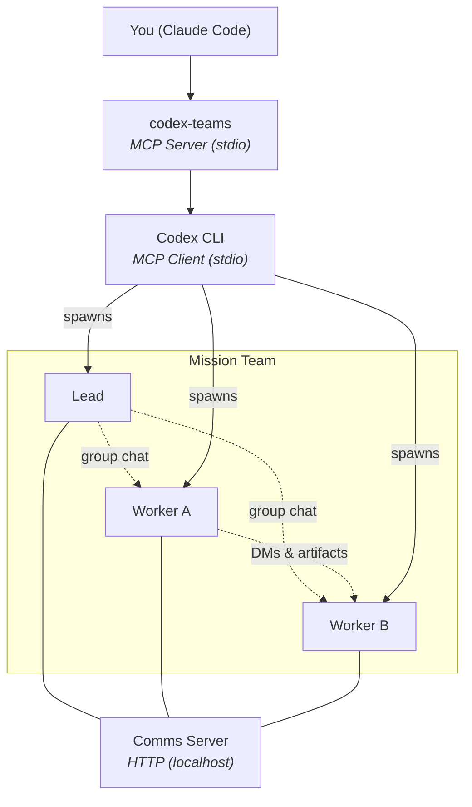

# codex-teams

[](https://www.npmjs.com/package/codex-teams)
[](LICENSE)
[](https://nodejs.org)

An MCP server that turns Claude Code into a team lead. Describe what you want built, researched, or planned — codex-teams spins up a coordinated team of [Codex CLI](https://github.com/openai/codex) agents that investigate in parallel, share findings in real time, and deliver results you can act on.

---

## Why

Claude Code is powerful, but it's one agent with one pair of eyes. Large codebases, multi-repo architectures, and cross-cutting concerns need more than a single thread of investigation. codex-teams gives you a team.

- **Deep research, fast.** Send workers to explore different parts of a codebase simultaneously — one traces the data flow, another maps the API surface, a third reads the tests. They share what they find as they go, building a complete picture no single agent could assemble alone
- **Plans that actually hold up.** When agents research together before proposing changes, the plan accounts for things a solo agent would miss — that service B depends on the response shape you're about to change, that there's a legacy migration script nobody remembers, that the test suite already covers the edge case you were worried about
- **Implementation with context.** Once the team has mapped the terrain, the lead can assign targeted work to each worker — and they already have the context from the research phase. No re-reading, no missed connections
- **Verification built in.** An optional command (like `npm test`) runs automatically after the work is done. If something breaks, the team fixes it before reporting back
- You launch a mission and go do other things. Check in when you're ready

---

## Quick Start

### Prerequisites

- [Claude Code](https://docs.anthropic.com/en/docs/claude-code) or any MCP-compatible client
- [Codex CLI](https://github.com/openai/codex) installed and on `PATH`
- Node.js 18+

### Install

**Claude Code**

```bash
claude mcp add-json codex-teams --scope user '{"command":"npx","args":["-y","codex-teams"]}'
```

**Cursor / Windsurf / VS Code**

Add to your MCP client config:

```json
{
  "mcpServers": {
    "codex-teams": {
      "command": "npx",
      "args": ["-y", "codex-teams"]
    }
  }
}
```

---

## How It Works

You describe an objective. codex-teams creates a team, assigns a lead, and launches workers — all running as parallel Codex threads. The lead coordinates, the workers execute, and they talk to each other throughout.

```
You: "Add user profile editing with validation, API endpoints, and tests"

codex-teams:
  → Creates a team: lead + frontend dev + backend dev + test engineer
  → Lead posts a plan in group chat with assignments
  → Workers read the plan and start building in parallel
  → Backend dev shares the API contract via artifacts
  → Frontend dev reads it and builds the form to match
  → Test engineer writes integration tests against both
  → npm test runs automatically — if something breaks, the team fixes it
  → You get back the results, artifacts, and full chat history
```

Missions return immediately. You can monitor progress, do other work, and check results when they're ready.

---

## Examples

### Plan a cross-cutting change

> "I need to change the user ID format from integer to UUID across the entire system. One worker maps every place user IDs appear in the API layer (src/api/), another traces them through the service layer (src/services/) and database queries (src/db/), and a third checks the frontend (src/client/) for hardcoded assumptions about ID format. The lead should compile a migration plan as a shared artifact: what changes where, in what order, what breaks if you get the sequence wrong, and what tests need updating. Don't change any code — deliver the plan."

### Research across repos

> "We're evaluating whether to extract the billing module into its own service. Worker A: map every import and function call into src/billing/ from the rest of the monorepo — I need to know the exact coupling surface. Worker B: trace the data flow for a checkout — from the API handler through billing to the payment provider and back. Worker C: read the test suite in tests/billing/ and document what's tested via unit tests vs integration tests vs not tested at all. Lead: synthesize into a feasibility report — can we extract cleanly, what are the hard dependencies, and what would the interface boundary look like?"

### Investigate and audit

> "Audit every API endpoint in src/api/ for consistent error handling. For each endpoint, document: what errors it catches, whether it returns structured error responses, and whether it logs failures. Produce a prioritized table of findings as a shared artifact. Don't fix anything — just report."

### Ship a feature

> "Add a /api/settings endpoint that supports GET and PUT for user preferences. The frontend worker should add a Settings page at /settings using the existing PageLayout component. Verify with npm test. Files to start from: src/api/routes.ts, src/pages/, src/components/PageLayout.tsx."

### Refactor with confidence

> "Refactor the database access layer in src/db/ from raw SQL to use the query builder in src/db/builder.ts. One worker owns the read queries, another owns the writes. Keep all existing tests passing. Verify with npm test."

> [!TIP]
> The more specific your objective, the better the results. Include file paths, acceptance criteria, constraints, and what "done" looks like. Research missions benefit most from telling each worker exactly where to look and what questions to answer — a team that knows it's producing a report with specific columns will deliver something actionable.

---

## Tools

### Mission Lifecycle

| Tool | Description |
|---|---|
| `launch_mission` | Start a coordinated mission with a lead and workers. Returns a `missionId` immediately |
| `mission_status` | Check progress — phase, recent group chat, artifact count |
| `await_mission` | Block until a mission completes. Returns full results |

### Communication & Control

| Tool | Description |
|---|---|
| `get_team_comms` | Live view of all team communication during a running mission |
| `get_mission_comms` | Full chat history and artifacts after completion (available 30 min) |
| `steer_team` | Interrupt agents mid-mission and redirect with a new directive |

---

## Configuration

Agents use sensible defaults. Override per-agent when launching a mission:

| Setting | Default | Options |
|---|---|---|
| **Model** | `gpt-5.4` | Any model supported by Codex CLI |
| **Sandbox** | `workspace-write` | `read-only`, `workspace-write`, `danger-full-access` |
| **Reasoning** | `xhigh` (lead) / `high` (workers) | `xhigh`, `high`, `medium`, `low`, `minimal` |
| **Fast Mode** | `false` | `true` for faster output (service_tier=fast) |

---

## Architecture


```mermaid
graph TD
    U["You (Claude Code)"] --> CT["codex-teams<br/><i>MCP Server (stdio)</i>"]
    CT --> C["Codex CLI<br/><i>MCP Client (stdio)</i>"]

    subgraph "Mission Team"
      L["Lead"]
      W1["Worker A"]
      W2["Worker B"]
      L -.->|"group chat"| W1
      L -.->|"group chat"| W2
      W1 -.->|"DMs & artifacts"| W2
    end

    C -->|spawns| L
    C -->|spawns| W1
    C -->|spawns| W2

    COMMS["Comms Server<br/><i>HTTP (localhost)</i>"]
    L --- COMMS
    W1 --- COMMS
    W2 --- COMMS
```

Three layers run simultaneously:

1. **Stdio MCP Server** — Claude Code connects here. Exposes mission, status, and steering tools
2. **Stdio MCP Client** — Connects to `codex mcp-server` to spawn and message Codex agents
3. **HTTP Comms Server** — Localhost-only Express server injected into each agent's MCP config. Handles group chat, DMs, shared artifacts, and per-agent auth

---

## Team Sizing

- **1 lead + 1–3 workers** is the sweet spot
- More workers means more coordination overhead with diminishing returns
- Match worker count to genuinely parallelizable work streams
- Each worker should own a distinct, non-overlapping scope

---

## Development

```bash
git clone https://github.com/skrabe/codex-teams.git
cd codex-teams
npm install
npm run build
node --import tsx --test tests/*.test.ts
```

---

## Uninstall

```bash
# Claude Code
claude mcp remove codex-teams

# Other clients: remove the codex-teams entry from your MCP config
```

---

## License

[MIT](LICENSE)
