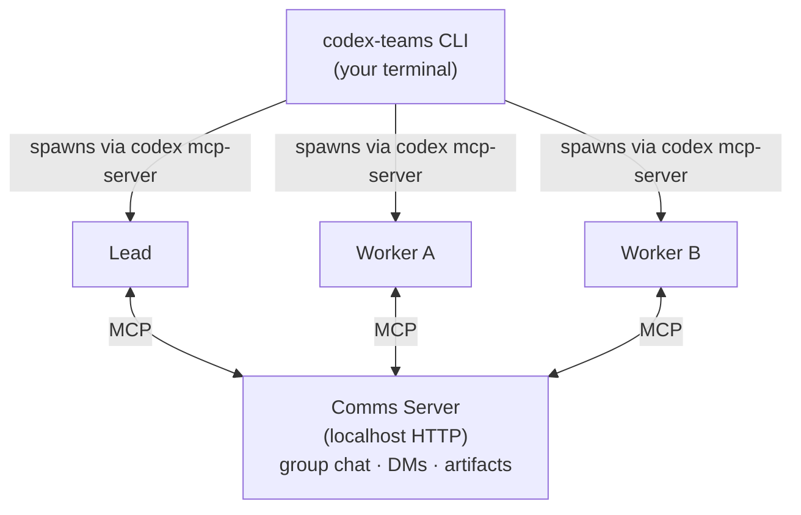

# codex-teams

[](https://www.npmjs.com/package/codex-teams)
[](LICENSE)
[](https://nodejs.org)

A CLI that orchestrates teams of [Codex CLI](https://github.com/openai/codex) agents. Describe what you want built, researched, or planned — codex-teams spins up a lead + workers that communicate in real time, share discoveries, and deliver results.

---

## Install

```bash
npm install -g codex-teams
```

Then install the skill for your AI coding tools:

```bash
codex-teams setup
```

This auto-detects [Claude Code](https://code.claude.com), [Codex CLI](https://github.com/openai/codex), [OpenCode](https://opencode.ai), and [Factory Droid](https://factory.ai) and installs the codex-teams skill so your AI assistant knows how to use it automatically.

### Prerequisites

- [Codex CLI](https://github.com/openai/codex) installed and on `PATH` (`npm install -g @openai/codex`)
- Node.js 18+

---

## Quick Start

```bash
cd your-project

# Launch a mission — blocks until complete, prints JSON result
codex-teams launch \
  --objective "Add JWT auth with login/register endpoints, middleware, and tests" \
  --lead "Tech Lead" \
  --worker "Backend Engineer" \
  --worker "Test Engineer" \
  --verify "npm test"
```

That's it. The lead plans, workers execute in parallel, they talk to each other, `npm test` runs automatically — you get back JSON with everything they did.

---

## Why

A single AI coding agent has one context window. When the task spans multiple layers — API, frontend, tests, configs — it has to constantly switch context, losing track of details. codex-teams solves this by giving each agent its own context window focused on its scope. They communicate through group chat, DMs, and shared artifacts, coordinating like a real engineering team.

- **More context, not just more speed.** Each agent holds its own full context for its scope. Together, the team sees far more of the codebase than one agent ever could.
- **Agents help each other.** The backend dev shares the API contract; the frontend dev reads it and builds to match. Workers ask each other questions, flag integration issues, and share discoveries as they go.
- **Verification built in.** A shell command (like `npm test`) runs after completion. If it fails, the lead assigns fixes, workers retry, and it runs again.
- **You launch and walk away.** Check results when you're ready.

---

## Commands

### `launch` — Run a mission

```bash
codex-teams launch \
  --objective "..." \
  --lead "Tech Lead" \
  --worker "Backend Engineer" \
  --worker "Frontend Engineer" \
  --verify "npm test"
```

Blocks until done. Progress streams to stderr, JSON result to stdout. Exit code 0 = success.

| Flag | Default | Description |
|---|---|---|
| `--objective <text>` | *(required)* | What to accomplish. Be specific. |
| `--lead <role>` | `"Lead"` | Lead agent role name |
| `--worker <roles...>` | *(required)* | Worker roles (repeatable) |
| `--verify <command>` | — | Shell command to verify after completion |
| `--max-retries <n>` | `2` | Verification retry attempts |
| `--sandbox <mode>` | `workspace-write` | `plan-mode` / `workspace-write` / `danger-full-access` |
| `--reasoning <effort>` | `xhigh`/`high` | `xhigh` / `high` / `medium` / `low` / `minimal` |
| `--fast` | `false` | Enable fast output mode |
| `--team-json <json>` | — | Full team config as JSON (overrides --lead/--worker) |

### `status` — Check missions

```bash
codex-teams status                  # List all active missions
codex-teams status <missionId>      # Check a specific mission
```

### `steer` — Redirect mid-mission

```bash
codex-teams steer <missionId> --directive "Fix the auth bug first"
```

### `setup` — Install skill for AI tools

```bash
codex-teams setup           # Auto-detect and install for all found tools
codex-teams setup --claude   # Claude Code only
codex-teams setup --codex    # Codex CLI only
codex-teams setup --all      # Install for everything
```

### `help` — Usage guide

```bash
codex-teams help --llm      # Full guide for LLM consumption
```

---

## Examples

### Ship a feature

```bash
codex-teams launch \
  --objective "Add user profile editing: PUT /api/users/:id endpoint accepting
{name, bio, avatarUrl} at src/api/users.ts, React form at src/components/ProfileForm.tsx
using existing Form primitives from src/components/ui/, and integration tests.
Follow the pattern in src/api/posts.ts for the endpoint." \
  --lead "Tech Lead" \
  --worker "Backend Engineer" \
  --worker "Frontend Engineer" \
  --verify "npm test"
```

### Audit a codebase

```bash
codex-teams launch \
  --objective "Audit every API endpoint in src/api/ for: (1) missing input validation,
(2) SQL injection vectors, (3) missing auth checks, (4) information leakage in error
responses. Document each finding with file, line, severity, and fix recommendation.
Output as a structured shared artifact." \
  --lead "Security Lead" \
  --worker "API Auditor" \
  --worker "Auth Auditor"
```

### Plan a migration

```bash
codex-teams launch \
  --objective "Map every place user IDs appear across src/api/, src/services/,
src/db/, and src/client/. Document the coupling surface, data flow, and hardcoded
assumptions about ID format. Deliver a migration plan as a shared artifact:
what changes where, in what order, what breaks. Don't change any code." \
  --lead "Lead Architect" \
  --worker "API Mapper" \
  --worker "DB Mapper" \
  --worker "Frontend Mapper"
```

### Refactor with confidence

```bash
codex-teams launch \
  --objective "Migrate all 12 class components in src/components/ to functional
components with hooks. Each must: (1) preserve identical props interface,
(2) convert lifecycle methods to useEffect, (3) convert this.state to useState,
(4) pass existing tests unchanged. Do NOT modify test files." \
  --lead "Migration Lead" \
  --worker "Component Dev A" \
  --worker "Component Dev B" \
  --verify "npm run typecheck && npm test"
```

> **Tip:** The more specific the objective, the better the results. Include file paths, acceptance criteria, constraints, and what "done" looks like.

---

## Advanced: `--team-json`

For full control over per-agent configuration:

```bash
codex-teams launch \
  --objective "..." \
  --team-json '[
    {"role": "Tech Lead", "isLead": true, "reasoningEffort": "xhigh"},
    {"role": "Backend", "specialization": "API design and database queries"},
    {"role": "Frontend", "specialization": "React components", "fastMode": true},
    {"role": "Tests", "specialization": "Integration testing"}
  ]'
```

---

## Team Sizing & Cost

Every agent is a full Codex CLI session making LLM API calls. Cost scales linearly with the number of agents and is further multiplied by reasoning level. A 1+2 team at `high` reasoning is roughly 3x a single agent; bump the lead to `xhigh` and add a fourth worker and you're at 5x+. Multiple teams multiply this again — a two-team mission with 3 agents each is 6 concurrent LLM sessions.

| Team | Best for | Relative cost |
|---|---|---|
| 1 lead + 1 worker | Simple tasks, one work stream | ~2x single agent |
| 1 lead + 2 workers | Most common — two parallel scopes (e.g., API + frontend) | ~3x |
| 1 lead + 3 workers | Complex features — three distinct scopes (e.g., API + UI + tests) | ~4x |
| 1 lead + 4+ workers | Rarely worth it — coordination overhead grows fast | 5x+ |

Use `--reasoning` to control cost per agent: `xhigh` is the most expensive, `minimal` is cheapest. The default is `xhigh` for the lead and `high` for workers. For exploratory or low-stakes work, dropping workers to `medium` cuts cost significantly. Use `--fast` for even cheaper but shallower output.

---

## How It Works

```
codex-teams launch --objective "Add auth with tests" --lead "Lead" --worker "Backend" --worker "Tests" --verify "npm test"

  1. Creates a team: lead + 2 workers
  2. Starts the comms server (localhost HTTP for group chat, DMs, artifacts)
  3. Sends all agents their prompts simultaneously
  4. Lead posts a plan in group chat → workers read it and execute
  5. Workers share discoveries and coordinate via chat
  6. npm test runs → if it fails, lead assigns fixes → workers retry
  7. JSON result printed to stdout
```

### Architecture


```mermaid
graph TD
    CLI["codex-teams CLI<br/>(your terminal)"]
    CLI -->|spawns via codex mcp-server| Lead["Lead"]
    CLI -->|spawns via codex mcp-server| WA["Worker A"]
    CLI -->|spawns via codex mcp-server| WB["Worker B"]
    Comms["Comms Server<br/>(localhost HTTP)<br/>group chat · DMs · artifacts"]
    Lead <-->|MCP| Comms
    WA <-->|MCP| Comms
    WB <-->|MCP| Comms
```

Each agent runs as a Codex CLI thread with its own context window. The comms server provides authenticated group chat, direct messages, shared artifacts, and a wait-for-messages mechanism.

Multiple teams are supported via `--team-json` — you can define separate teams each with their own lead and workers. However, every agent is a full Codex CLI session making LLM API calls, so costs scale directly with team size.

---

## Using with AI Coding Tools

After `codex-teams setup`, your AI assistant discovers codex-teams automatically. The installed skill teaches it:

1. **When to use codex-teams** — recognizes tasks that benefit from multiple agents
2. **How to gather context from you** — asks about objective, scope, constraints, team before launching
3. **How to write good objectives** — composes detailed engineering-ticket-quality prompts
4. **How to run and report results** — executes the CLI and presents the output

You can also invoke it manually: tell your AI assistant "use codex-teams to..." or reference the skill directly.

---

## Configuration

| Setting | Default | Options |
|---|---|---|
| Model | `gpt-5.4` | Any model supported by Codex CLI |
| Sandbox | `workspace-write` | `plan-mode`, `workspace-write`, `danger-full-access` |
| Reasoning | `xhigh` (lead) / `high` (workers) | `xhigh`, `high`, `medium`, `low`, `minimal` |
| Fast Mode | `false` | `true` for faster output |

---

## Development

```bash
git clone https://github.com/skrabe/codex-teams.git
cd codex-teams
npm install
npm run build          # TypeScript → ./build
npm run bundle         # esbuild → ./dist/index.cjs
npm run dev            # TypeScript watch mode
node --import tsx --test tests/*.test.ts    # Run all tests
```

---

## Uninstall

```bash
npm uninstall -g codex-teams
```

To remove installed skills:

```bash
rm -rf ~/.claude/skills/codex-teams
rm -rf ~/.codex/skills/codex-teams
rm -rf ~/.factory/skills/codex-teams
rm -rf ~/.config/opencode/skills/codex-teams
rm -rf ~/.agents/skills/codex-teams
```

---

## License

[MIT](LICENSE)
